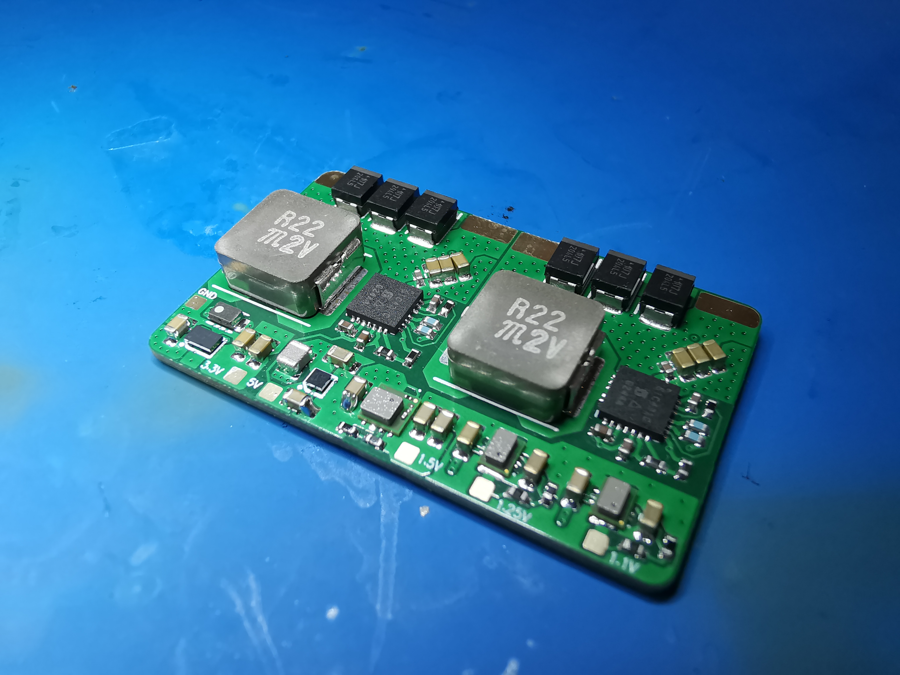
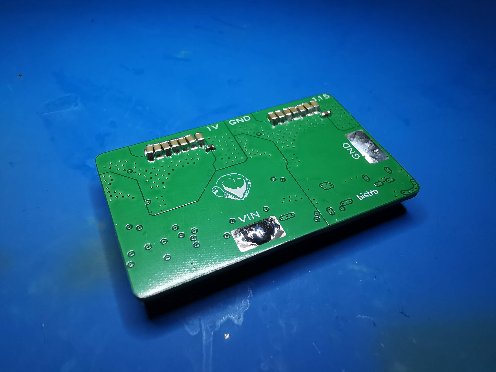

# bistro
Wii U regulator board. Runs a Wii U motherboard (no disc drive) from 1S lithium-ion. Licensed under TAPR OHL. Have fun!

- x2 SiC431C 24A buck regulators for 1v and 1.15v (CPU + GPU)
- x2 MUN3CAD01-SB 1A bucks for 1.1V and 1.25V (for DRH)
- x1 MUN3CAD03-SE 3A buck for 1.5V (RAM)
- x1 TPS63810YFFR 2.5A buck-boost for 3.3V
- x1 FAN48610BUC50X 5V 1A boost (USB)

[Mouser project with BOM](https://www.mouser.com/ProjectManager/ProjectDetail.aspx?State=EDIT&ProjectGUID=765ca4f1-a2ec-4813-aa1f-4cfbc3bead5a)

 

